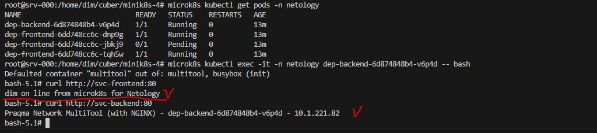
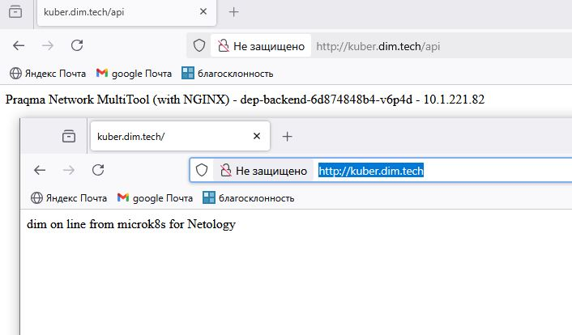

# Домашнее задание к занятию «Сетевое взаимодействие в K8S. Часть 2»


### Цель задания

В тестовой среде Kubernetes необходимо обеспечить доступ к двум приложениям снаружи кластера по разным путям.

------

### Чеклист готовности к домашнему заданию

1. Установленное k8s-решение (например, MicroK8S).
2. Установленный локальный kubectl.
3. Редактор YAML-файлов с подключённым Git-репозиторием.

------

### Инструменты и дополнительные материалы, которые пригодятся для выполнения задания

1. [Инструкция](https://microk8s.io/docs/getting-started) по установке MicroK8S.
2. [Описание](https://kubernetes.io/docs/concepts/services-networking/service/) Service.
3. [Описание](https://kubernetes.io/docs/concepts/services-networking/ingress/) Ingress.
4. [Описание](https://github.com/wbitt/Network-MultiTool) Multitool.

------

### Задание 1. Создать Deployment приложений backend и frontend

1. Создать Deployment приложения _frontend_ из образа nginx с количеством реплик 3 шт.
2. Создать Deployment приложения _backend_ из образа multitool. 
3. Добавить Service, которые обеспечат доступ к обоим приложениям внутри кластера. 
4. Продемонстрировать, что приложения видят друг друга с помощью Service.
5. Предоставить манифесты Deployment и Service в решении, а также скриншоты или вывод команды п.4.

**Ответ.**

1. [deployment-frontend.yaml](deployment-frontend.yaml)

    <details><summary>deployment-frontend.yaml</summary>

    ```yaml
    ---
    apiVersion: apps/v1
    kind: Deployment
    metadata:
    name: Dep-frontend
    labels:
        task: one
        tier: homework
    annotations:
        container: nginx
    namespace: netology
    spec:
    replicas: 3
    strategy:
        rollingUpdate:
        maxSurge: 1
        maxUnavailable: 1
        type: RollingUpdate
    selector:
        matchLabels:
        type: frontend 
    template:
        metadata:
        labels:
            app: nginx
            type: frontend 
        spec:
        containers:
            - name: nginx
            image: nginx:1.24.0
            resources:
                limits:
                memory: "128Mi"
                cpu: "500m"
                requests:
                memory: "64Mi"
                cpu: "250m"
            volumeMounts:
                - name:  nginx-index
                mountPath: "/usr/share/nginx/html"
            ports:
                - name: http-nginx
                containerPort: 80
            livenessProbe:
                tcpSocket:
                port: 80
                initialDelaySeconds: 10
                timeoutSeconds: 3
            readinessProbe:
                httpGet:
                path: /
                port: 80
                initialDelaySeconds: 15
                timeoutSeconds: 5
                successThreshold: 1
                failureThreshold: 4
        initContainers:
            - name: init-wait-svc
            image: busybox:1.36.1
            resources:
                limits:
                memory: "64Mi"
                cpu: "250m"
                requests:
                memory: "8Mi"
                cpu: "50m"
            env:
                - name: TARGET
                value: "svc-frontend"
            command: ['sh', '-c', "until nslookup $TARGET.$(cat /var/run/secrets/kubernetes.io/serviceaccount/namespace).svc.cluster.local; do sleep 2; done"]
            - name: init-busybox
            image: busybox:1.36.1
            resources:
                limits:
                memory: "32Mi"
                cpu: "100m"
                requests:
                memory: "8Mi"
                cpu: "50m"
            command: ['sh', '-c', "echo dim on line from microk8s for Netology > /usr/share/nginx/html/index.html"]
            volumeMounts:
                - name:  nginx-index
                mountPath: "/usr/share/nginx/html"
        volumes:
            - name:  nginx-index
            emptyDir: {}
    ...
    ```

    </details>

2. [deployment-backend.yaml](deployment-backend.yaml)

    <details><summary>deployment-backend.yaml</summary>

    ```yaml
    ---
    apiVersion: apps/v1
    kind: Deployment
    metadata:
    name: dep-backend
    labels:
        task: one
        tier: homework
    annotations:
        container: multitool
    namespace: netology
    spec:
    replicas: 1
    strategy:
        rollingUpdate:
        maxSurge: 1
        maxUnavailable: 1
        type: RollingUpdate
    selector:
        matchLabels:
        type: backend 
    template:
        metadata:
        labels:
            app: multitool
            type: backend
        spec:
        containers:
            - name: multitool
            image: praqma/network-multitool:alpine-extra
            resources:
                limits:
                memory: "128Mi"
                cpu: "450m"
                requests:
                memory: "32Mi"
                cpu: "150m"
            env:
                - name: HTTP_PORT
                value: "8080"
                - name: HTTPS_PORT
                value: "8443"
            ports:
                - name: http-multitool
                containerPort: 8080
                protocol: TCP
                - name: https-multitool
                containerPort: 8443
                protocol: TCP
            livenessProbe:
                tcpSocket:
                port: 8080
                initialDelaySeconds: 10
                timeoutSeconds: 3
            readinessProbe:
                httpGet:
                path: /
                port: 8080
                initialDelaySeconds: 15
                timeoutSeconds: 5
                successThreshold: 1
                failureThreshold: 2
        initContainers:
            - name: busybox
            image: busybox:1.36.1
            resources:
                limits:
                memory: "64Mi"
                cpu: "250m"
                requests:
                memory: "8Mi"
                cpu: "50m"
            env:
                - name: TARGET
                value: "svc-backend"
            command: ['sh', '-c', "until nslookup $TARGET.$(cat /var/run/secrets/kubernetes.io/serviceaccount/namespace).svc.cluster.local; do sleep 2; done"]
    ...
    ```

    </details>

3. Два сервиса:
    - [service-frontend.yaml](service-frontend.yaml)

        <details><summary>service-frontend.yaml</summary>

        ```yaml
        ---
        apiVersion: v1
        kind: Service
        metadata:
        name: svc-frontend
        namespace: netology
        spec:
        selector:
            app: nginx
            type: frontend 
        type: ClusterIP
        ports:
            - name: nginx
            port: 80
            targetPort: http-nginx
        ...
        ```

        </details>

    - [service-backend.yaml](service-backend.yaml)

        <details><summary>service-backend.yaml</summary>

        ```yaml
        ---
        apiVersion: v1
        kind: Service
        metadata:
        name: svc-backend
        namespace: netology
        spec:
        selector:
            app: multitool
            type: backend
        type: ClusterIP
        ports:
            - name: multitool
            port: 80
            targetPort: http-multitool
        ...
        ```

        </details>

4. 

 
    `root@srv-000:/home/dim/cuber/minik8s-4# microk8s kubectl get pods -n netology
    NAME                            READY   STATUS    RESTARTS   AGE
    dep-backend-6d874848b4-v6p4d    1/1     Running   0          13m
    dep-frontend-6dd748cc6c-dnp9g   1/1     Running   0          13m
    dep-frontend-6dd748cc6c-jbkj9   0/1     Pending   0          13m
    dep-frontend-6dd748cc6c-tqh5w   1/1     Running   0          13m
    root@srv-000:/home/dim/cuber/minik8s-4# microk8s kubectl exec -it -n netology dep-backend-6d874848b4-v6p4d -- bash 
    Defaulted container "multitool" out of: multitool, busybox (init)
    bash-5.1# curl http://svc-frontend:80
    dim on line from microk8s for Netology
    bash-5.1# curl http://svc-backend:80
    Praqma Network MultiTool (with NGINX) - dep-backend-6d874848b4-v6p4d - 10.1.221.82
    bash-5.1# exit
    exit
    root@srv-000:/home/dim/cuber/minik8s-4# `


------

### Задание 2. Создать Ingress и обеспечить доступ к приложениям снаружи кластера

1. Включить Ingress-controller в MicroK8S.
2. Создать Ingress, обеспечивающий доступ снаружи по IP-адресу кластера MicroK8S так, чтобы при запросе только по адресу открывался _frontend_ а при добавлении /api - _backend_.
3. Продемонстрировать доступ с помощью браузера или `curl` с локального компьютера.
4. Предоставить манифесты и скриншоты или вывод команды п.2.

**Ответ.**

1. Включил ingress controler microk8s enable ingress
2. [ingress.yaml](ingress.yaml)

    <details><summary>ingress.yaml</summary>

    ```yaml
    ---
    apiVersion: networking.k8s.io/v1
    kind: Ingress
    metadata:
    name: ingress-hw
    labels:
        name: ingress-microk8s
    namespace: netology
    annotations:
        nginx.ingress.kubernetes.io/rewrite-target: /
    spec:
    ingressClassName: "nginx"
    rules:
        - host: kuber.dim.tech
        http:
            paths:
            - path: /
                pathType: Prefix
                backend:
                service:
                    name: svc-frontend
                    port:
                    name: nginx
            - path: /api
                pathType: Prefix
                backend:
                service:
                    name: svc-backend
                    port:
                    name: multitool
    ...
    ```

    </details>

3. 


    root@srv-000:/home/dim/cuber/minik8s-4# microk8s enable ingress
    Infer repository core for addon ingress
    Enabling Ingress
    ingressclass.networking.k8s.io/public created
    ingressclass.networking.k8s.io/nginx created
    namespace/ingress created
    serviceaccount/nginx-ingress-microk8s-serviceaccount created
    clusterrole.rbac.authorization.k8s.io/nginx-ingress-microk8s-clusterrole created
    role.rbac.authorization.k8s.io/nginx-ingress-microk8s-role created
    clusterrolebinding.rbac.authorization.k8s.io/nginx-ingress-microk8s created
    rolebinding.rbac.authorization.k8s.io/nginx-ingress-microk8s created
    configmap/nginx-load-balancer-microk8s-conf created
    configmap/nginx-ingress-tcp-microk8s-conf created
    configmap/nginx-ingress-udp-microk8s-conf created
    daemonset.apps/nginx-ingress-microk8s-controller created
    Ingress is enabled
    root@srv-000:/home/dim/cuber/minik8s-4# microk8s kubectl apply -f ingress.yaml 
    ingress.networking.k8s.io/ingress-hv created
    root@srv-000:/home/dim/cuber/minik8s-4# 

------

### Правила приема работы

1. Домашняя работа оформляется в своем Git-репозитории в файле README.md. Выполненное домашнее задание пришлите ссылкой на .md-файл в вашем репозитории.
2. Файл README.md должен содержать скриншоты вывода необходимых команд `kubectl` и скриншоты результатов.
3. Репозиторий должен содержать тексты манифестов или ссылки на них в файле README.md.

------
